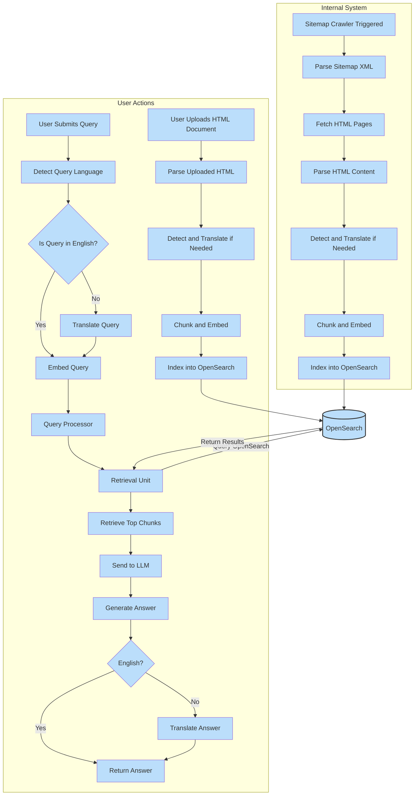
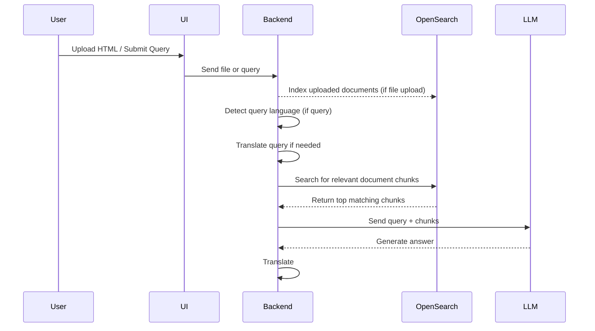
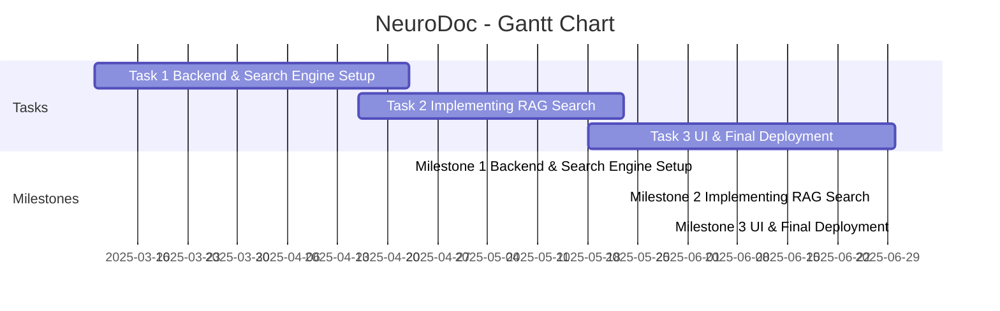

# SmartdocsAI - Intelligent Search Engine for Documents

## Project Evaluation

### Introduction
SmartdocsAI is an intelligent search engine designed to enhance document retrieval by leveraging **Retrieval-Augmented Generation (RAG)** and **LLM (Large Language Models)**. The system processes unstructured text data, retrieves relevant documents, and generates intelligent responses, improving information access in enterprise settings. Developed in cooperation with **Neurosoft Sp. z o.o.**, the project integrates **Django** for backend development and **OpenSearch** for efficient document indexing.

### State-of-the-Art Overview
Current search engines rely on either traditional keyword-based retrieval or AI-driven models. Standard search systems use **TF-IDF** or **BM25**, while modern AI solutions incorporate **vector embeddings** for semantic search. NeuroDoc aims to **combine these approaches** using RAG, enhancing search accuracy by providing **contextually relevant** responses instead of just retrieving documents. Existing solutions like ChatGPT plugins and hybrid search systems lack real-time adaptability for enterprise document search.

## System Workflow  

### Query Processing Flow (Multilingual & RAG Search)


```mermaid
flowchart TB
    %% User Actions
    subgraph User Actions
        B1[User Uploads HTML Document] --> B2[Parse Uploaded HTML]
        B2 --> B3[Detect and Translate if Needed]
        B3 --> B4[Chunk and Embed]
        B4 --> B5[Index into OpenSearch]
        
        C1[User Submits Query] --> C2[Detect Query Language]
        C2 --> C3{Is Query in English?}
        C3 -->|Yes| C4[Embed Query]
        C3 -->|No| C5[Translate Query]
        C5 --> C4
        C4 --> C6[Query Processor]
        C6 --> C7[Retrieval Unit]
        C7 --> C8[Retrieve Top Chunks]
        C8 --> C9[Send to LLM]
        C9 --> C10[Generate Answer]
        C10 --> C11{English?}
        C11 -->|Yes| C12[Return Answer]
        C11 -->|No| C13[Translate Answer]
        C13 --> C12
    end

    %% Internal System Actions (Hidden from user)
    subgraph Internal System
        A1[Sitemap Crawler Triggered] --> A2[Parse Sitemap XML]
        A2 --> A3[Fetch HTML Pages]
        A3 --> A4[Parse HTML Content]
        A4 --> A5[Detect and Translate if Needed]
        A5 --> A6[Chunk and Embed]
        A6 --> A7[Index into OpenSearch]
    end

    %% Database
        OS[(OpenSearch)]

    %% Database communication
    A7 --> OS
    B5 --> OS
    C7 -->|Query OpenSearch| OS
    OS -->|Return Results| C7

    %% Styling - Adding blue to all nodes
    style A1 fill:#bbdefb
    style A2 fill:#bbdefb
    style A3 fill:#bbdefb
    style A4 fill:#bbdefb
    style A5 fill:#bbdefb
    style A6 fill:#bbdefb
    style A7 fill:#bbdefb
    style B1 fill:#bbdefb
    style B2 fill:#bbdefb
    style B3 fill:#bbdefb
    style B4 fill:#bbdefb
    style B5 fill:#bbdefb
    style OS fill:#bbdefb,stroke:#333,stroke-width:2px
    style C1 fill:#bbdefb
    style C2 fill:#bbdefb
    style C3 fill:#bbdefb
    style C4 fill:#bbdefb
    style C5 fill:#bbdefb
    style C6 fill:#bbdefb
    style C7 fill:#bbdefb
    style C8 fill:#bbdefb
    style C9 fill:#bbdefb
    style C10 fill:#bbdefb
    style C11 fill:#bbdefb
    style C12 fill:#bbdefb
    style C13 fill:#bbdefb

```

The following diagram illustrates the **query processing workflow** in NeuroDoc:  


```mermaid
sequenceDiagram
    participant User
    participant UI
    participant Backend
    participant OpenSearch
    participant LLM

    User ->> UI: Upload HTML / Submit Query
    UI ->> Backend: Send file or query
    Backend -->> OpenSearch: Index uploaded documents (if file upload)
    Backend ->> Backend: Detect query language (if query)
    Backend ->> Backend: Translate query if needed
    Backend ->> OpenSearch: Search for relevant document chunks
    OpenSearch -->> Backend: Return top matching chunks
    Backend ->> LLM: Send query + chunks
    LLM -->> Backend: Generate answer
    Backend ->> Backend: Translate

```

## Solution

### Idea of the Solution

**NeuroDoc** integrates **OpenSearch** with a **Django-based backend** to build a robust and scalable intelligent search system. The system consists of:

- **Backend (Django)**
  - Implements the API for document upload and indexing.
  - Processes user input, retrieves documents, and passes data to the LLM.
  - Utilizes the **RAG method** to generate AI-enhanced responses.

- **Search Engine (OpenSearch)**
  - Indexes and retrieves documents efficiently.
  - Supports both **keyword-based** and **vector-based** search.
  - Uses **BM25** (default in OpenSearch) for traditional retrieval and **SentenceTransformer-based embeddings** for semantic matching.
  - saves recent user search

- **Frontend (Django Templates)**
  - Provides an interactive UI using Django HTML templates for users to input queries and receive search results.
  - Displays retrieved documents with highlighting and search suggestions.

---

### Details of the Solution

The system follows a **three-step process**:

1. **Indexing Phase**  
   - Uploaded HTML documents or crawled web pages are parsed.
   - Language is detected and content is translated if needed.
   - Documents are chunked into small pieces.
   - Each chunk is embedded into a dense vector using **SentenceTransformer** models.
   - Chunks and metadata (e.g., file name, language) are indexed into **OpenSearch** for efficient retrieval.

2. **Retrieval Phase**  
   - When a user submits a query, the system first detects the query language.
   - If the query is not in English, it is translated into English.
   - The query is embedded into a vector.
   - The embedded query is used to search **OpenSearch**, retrieving the top relevant document chunks based on semantic similarity.

3. **Response Generation Phase (RAG)**  
   - Retrieved document chunks and the user's query are sent together to the **LLM** (e.g., DeepSeek or OpenAI).
   - The LLM generates a grounded answer based on the retrieved context.
   - If needed, the generated answer is translated back into the user's original language.
   - The final answer is returned to the frontend and displayed to the user.

## Current Implementation Status

### Backend Development (Matio)

#### 1. **Django Backend Structure**
- **Main Django App**: `ndoc/` - Core Django project with settings, URLs, and OpenSearch configuration
- **Search App**: `search/` - Handles search functionality with multiple search modes
- **Docs App**: `docs/` - Serves documentation files and handles document browsing
- **Tools Module**: `tools/` - Command-line tools for document processing and indexing

#### 2. **Search Implementation**
- **Multiple Search Modes**: Keyword, Semantic, and Hybrid search
- **Language Support**: English and Polish with language-specific analyzers
- **Vector Embeddings**: Using `sentence-transformers` with `all-MiniLM-L6-v2` model
- **OpenSearch Integration**: Direct integration with OpenSearch for indexing and retrieval

#### 3. **Document Processing Pipeline**
- **HTML Processing**: `tools/text.py` with `TableAwareExtractor` for clean text extraction
- **Semantic Chunking**: `tools/semantic_chunker.py` for intelligent document chunking
- **Indexing Tools**: `tools/index.py` and `tools/semantic_index.py` for bulk indexing

#### 4. **Key Features Implemented**
- **Hybrid Search**: Combines keyword and semantic search for better results
- **Language Detection**: Automatic language detection and filtering
- **Highlighting**: Search result highlighting with context snippets
- **Pagination**: Efficient pagination for large result sets
- **Suggestions**: Query suggestions for better user experience

---

### Database Development

#### 1. **OpenSearch Configuration**
- **Docker Setup**: Complete Docker Compose setup with OpenSearch and Dashboards
- **Polish Language Support**: Custom Dockerfile with Polish language analyzer plugin
- **Index Structure**: Multiple indices for documents, sections, and semantic chunks
- **Vector Search**: KNN vector search with HNSW algorithm for semantic similarity

#### 2. **Index Architecture**
- **Document Index**: `ndoc_documents` - Document-level metadata and summaries
- **Section Index**: `ndoc_sections` - Section-level content with hierarchical structure
- **Semantic Index**: `ndoc_semantic_chunks` - Vector-based chunks for semantic search

#### 3. **Language-Specific Features**
- **Polish Analyzer**: Stempel stemming and Polish stopwords
- **English Analyzer**: Standard English text analysis
- **Dynamic Templates**: Automatic field routing based on language suffixes

---

### Frontend Development

#### 1. **UI Implementation**
- **Modern Interface**: Clean, responsive design with dark/light theme support
- **Multilingual Support**: English, and Polish language options
- **Search History**: Persistent search history with clickable tags
- **File Upload**: Support for HTML document uploads
- **Real-time Feedback**: Loading indicators and error handling

#### 2. **Key Components**
- **SearchBar**: Advanced search input with file upload capability
- **ResponseArea**: Dynamic response display with typing animation
- **Language Selector**: Dropdown for language selection
- **Theme Toggle**: Light/dark mode switching
- **Search History**: Recent queries with individual removal

#### 3. **API Integration**
- **Backend Communication**: RESTful API calls to Django backend
- **Error Handling**: Graceful error handling for network issues
- **Loading States**: User feedback during search operations

## Backend Workflow

The backend workflow in **NeuroDoc** supports three main processing paths, each triggered by a specific type of action. These are:

1. **Case 1: Search Query Submission**
2. **Case 2: HTML Document Upload**
3. **Case 3: Automated Sitemap Crawling**

Each path flows through dedicated modules within the Django backend and contributes to enriching or querying the document knowledge base.

### Case 1: user submits query

When a user submits a search query, the **Search & Retrieval Module** detects the query language, translates it if needed, embeds the query, and retrieves the most relevant chunks from **OpenSearch** using hybrid search. These chunks are passed to the **LLM Integration Module**, which generates a context-aware answer. If necessary, the answer is translated back before being returned to the frontend.

```plaintext
╔════════════════════════════════════════════════════════════════════════╗
║                        CASE 1: User Submits Query                      ║
╚════════════════════════════════════════════════════════════════════════╝

┌───────────────────────┐
│   User Interface      │
│    (React Frontend)   │
└──────────┬────────────┘
           │ (GET /search/?q=...&mode=...)
           ▼
┌──────────────────────────────────────┐
│ Django Backend (DRF Server Layer)    │
│ - API routing (urls.py)              │
│ - Request validation (serializers.py)│
│ - CORS handling (settings.py)        │
└──────────┬───────────────────────────┘
           ▼
┌──────────────────────────────────────┐
│ Search & Retrieval Module            │
│ (search/views.py)                    │
│ - search_documents()                 │
│ - semantic_search_documents()        │
│ - detect_language()                  │
└──────────┬───────────────────────────┘
           ▼
┌─────────────────────────────┐
│ Embedding Module            │
│ (search/embeddings.py)      │
│ - encode_query_for_search() │
└──────────┬──────────────────┘
           ▼
┌─────────────────────────────┐
│ OpenSearch Database         │
│ - Hybrid search             │
│ - Return top chunks         │
└──────────┬──────────────────┘
           ▼
┌──────────────────────────────┐
│ Response Formatting          │
│ (search/views.py)            │
│ - format_chunk_hit()         │
│ - highlight_results()         │
└──────────┬───────────────────┘
           ▼
┌──────────────────────────────┐
│ Return Response to Frontend  │
└──────────────────────────────┘
```

### Case 2: user uploads HTML document

When a user uploads an HTML document, the **Upload & Indexing Module** extracts and processes the text, detects the language, translates if required, and generates embeddings through the **Embedding Module**. The content and metadata are then indexed into **OpenSearch** for future queries.

```plaintext
╔════════════════════════════════════════════════════════════════════════╗
║                    CASE 2: User Uploads HTML Document                  ║
╚════════════════════════════════════════════════════════════════════════╝

┌───────────────────────┐
│   User Interface      │
│    (React Frontend)   │
└──────────┬────────────┘
           │ (POST /upload/)
           ▼
┌──────────────────────────────────────┐
│ Django Backend (DRF Server Layer)    │
│ - API routing (urls.py)              │
│ - Request validation (serializers.py)│
│ - CORS handling (settings.py)        │
└──────────┬───────────────────────────┘
           ▼
┌──────────────────────────────────────┐
│ Upload & Indexing Module             │
│ (tools/semantic_chunker.py)          │
│ - chunk_document()                   │
│ - detect_language()                  │
└──────────┬───────────────────────────┘
           ▼
┌─────────────────────────────┐
│ Embedding Module            │
│ (search/embeddings.py)      │
│ - encode_document_fields()  │
└──────────┬──────────────────┘
           ▼
┌─────────────────────────────┐
│ OpenSearch Database         │
│ - Store vectors & metadata  │
└─────────────────────────────┘
```

### Case 3: Sitemap Crawler Triggered

In the case of the automated sitemap crawler, the system parses a given sitemap XML, downloads the linked HTML pages, and processes them in the same way as user-uploaded documents. This scheduled or triggered backend task allows NeuroDoc to continuously ingest external documentation without user intervention.

```plaintext
╔════════════════════════════════════════════════════════════════════════╗
║                   CASE 3: Sitemap Crawler Triggered                    ║
╚════════════════════════════════════════════════════════════════════════╝

┌──────────────────────────────┐
│ Trigger (Button or Scheduler)│
└──────────┬───────────────────┘
           ▼
┌──────────────────────────────────────┐
│ Django Backend (DRF Server Layer)    │
│ - API routing (urls.py)              │
│ - Request validation (serializers.py)│
└──────────┬───────────────────────────┘
           ▼
┌──────────────────────────────────────┐
│ Sitemap Crawler Module               │
│ (tools/catalog.py)                   │
│ - parse_sitemap()                    │
│ - download_and_index_url()           │
└──────────┬───────────────────────────┘
           ▼
┌──────────────────────────────────────┐
│ Upload & Indexing Module             │
│ (tools/semantic_chunker.py)          │
│ - chunk_document()                   │
│ - detect_language()                  │
└──────────┬───────────────────────────┘
           ▼
┌─────────────────────────────┐
│ Embedding Module            │
│ (search/embeddings.py)      │
│ - encode_document_fields()  │
└──────────┬──────────────────┘
           ▼
┌─────────────────────────────┐
│ OpenSearch Database         │
│ - Store vectors & metadata  │
└─────────────────────────────┘
```

# 🧩 Module Overview: Files, Functions, and Descriptions

| Module | Files/Classes/Functions Inside | Description |
|:-------|:-------------------------------|:------------|
| **Django Backend Server** | `ndoc/urls.py`, `ndoc/settings.py`, `ndoc/opensearch.py` | Main Django project layer. Handles request routing, OpenSearch configuration, and project settings. |
| **Search Module** | `search/views.py` <br> — `search_documents()` <br> — `semantic_search_documents()` <br> — `get_search_options()` | Handles search requests: processes queries, detects language, performs hybrid/semantic search, and formats results. |
| **Semantic Search** | `search/simple_semantic.py` <br> — `search_semantic_chunks()` <br> — `hybrid_search_chunks()` <br> — `format_chunk_hit()` | Implements vector-based semantic search using OpenSearch KNN with cosine similarity. |
| **Embedding Service** | `search/embeddings.py` <br> — `EmbeddingService` class <br> — `encode_query_for_search()` <br> — `encode_document_fields()` | Generates dense vector embeddings using SentenceTransformer models for semantic search. |
| **Document Processing** | `docs/views.py` <br> — `DocsView` class <br> — `_get_user_language()` <br> — `_build_href()` | Serves documentation files, handles language detection, and provides document browsing interface. |
| **Indexing Tools** | `tools/index.py` <br> — `index_catalog()` <br> — `process_sections()` <br> — `ensure_indices()` | Bulk imports JSON catalog into OpenSearch with language-specific analyzers and document/section indexing. |
| **Semantic Indexing** | `tools/semantic_index.py` <br> — `create_semantic_index()` <br> — `index_chunks()` <br> — `generate_embeddings()` | Creates and populates semantic chunks index with vector embeddings for semantic search. |
| **Semantic Chunking** | `tools/semantic_chunker.py` <br> — `SemanticChunker` class <br> — `chunk_document()` <br> — `_split_text_semantically()` | Creates intelligent document chunks preserving semantic meaning with overlap for context continuity. |
| **Text Processing** | `tools/text.py` <br> — `TableAwareExtractor` class | Extracts clean text from HTML documents while preserving table structure and formatting. |
| **Catalog Management** | `tools/catalog.py` <br> — `extract_title()` <br> — `extract_summary()` | Handles document metadata extraction and catalog management for document discovery. |
| **Database (OpenSearch)** | (External) OpenSearch indices | Stores document chunks, embeddings, and metadata. Supports keyword, semantic, and hybrid search with language-specific analyzers. |

## Backend–Frontend Communication

The NeuroDoc system follows a **server-side rendering architecture** where the **Django HTML templates** are served directly by the **Django backend**.  
All interactions between the frontend and backend are handled through Django's built-in template system and form processing.

## 📤 Communication Flow

- **Frontend (Django Templates)** collects user actions such as:
  - Browsing documentation catalog
  - Entering search queries with different modes

- **Frontend sends corresponding HTTP requests** to the Django backend:
  - **Search queries:** `GET /search/?q=...&mode=...&lang=...`
  - **Document browsing:** `GET /docs/` and `GET /docs/<path>/`

- **Sitemap crawling** is handled entirely by the backend:
  - It can be triggered manually (via admin or CLI)
  - Or scheduled as a background task 
  - It fetches and processes HTML pages listed in a given sitemap XML

- **Backend (Django)** processes incoming requests by:
  - Parsing and validating data using Django's built-in validation
  - Routing through view functions defined in `views.py`
  - Rendering HTML templates with context data

- **Backend modules perform the appropriate tasks:**
  - Extract and preprocess text using `tools/text.py`
  - Detect language and translate if needed
  - Generate semantic embeddings via `sentence-transformers`
  - Store content and metadata into **OpenSearch**
  - Retrieve relevant chunks and generate answers via semantic search

- **Backend returns HTML responses** to the frontend:
  - Rendered search results with highlighting and suggestions
  - Document catalog pages with pagination
  - Individual document pages with language support

- **Frontend displays** the UI based on backend responses:
  - Showing search results with snippets and metadata
  - Displaying document browsing interface

---

# 🔗 API Endpoints Overview

| Endpoint               | Method | Purpose                                                       |
|:-----------------------|:-------|:--------------------------------------------------------------|
| `/search/`             | GET    | Search documents with multiple modes (keyword/semantic/hybrid) |
| `/search/semantic/`    | GET    | Semantic search using vector similarity                       |
| `/search/api/search-options/` | GET | Get available search options and configurations |
| `/docs/`               | GET    | Browse and serve documentation files                          |
| `/docs/<path>/`        | GET    | Serve specific documentation files with language support       |

---

# ⚙️ Key Communication Technologies

| Component                    | Technology                                                                 |
|:-----------------------------|:----------------------------------------------------------------------------|
| **Template Engine**           | Django HTML templates with template inheritance and context rendering        |
| **Data Exchange**            | HTML forms and GET parameters for search queries                            |
| **Server-Side Rendering**    | Django template system with static file serving                            |
| **Search and Storage**       | OpenSearch (supports hybrid search: BM25 + vector similarity)              |
| **Semantic Search**          | SentenceTransformer embeddings with OpenSearch KNN                         |


## 🛠️ Technologies

| Component         | Technology |
|-------------------|-------------|
| Backend Framework | Django with custom views and URL routing |
| Search Engine     | OpenSearch (hybrid keyword and vector search) |
| Semantic Search   | SentenceTransformer (all-MiniLM-L6-v2) with OpenSearch KNN |
| Embedding Model   | `sentence-transformers` library |
| Template Engine   | Django HTML templates with template inheritance |
| HTML Parsing      | Custom `TableAwareExtractor` in `tools/text.py` |
| Language Detection| Django's built-in language detection |
| OpenSearch Client | `opensearch-py` |
| Document Processing| Custom semantic chunking with overlap |
| Frontend          | Django templates with CSS styling |

---

## 🖥️ Frontend Details of the Solution

Below is a deep dive into the **Django template-based UI** of NeuroDoc, focusing on how the interface works from the user's side — including styling, template inheritance, responsiveness, and multilingual support.

---

### 1. ⚙️ Template Structure

- **Base Template**
  - Uses Django template inheritance with `index.html` as the base template
  - Includes common CSS styling and Bootstrap Icons
  - Provides consistent layout across all pages

- **Language Support**
  - The UI supports English and Polish with language-specific text
  - Language switching through URL parameters (`?lang=en` or `?lang=pl`)
  - Template conditionals for language-specific content

---

### 2. 🔍 Search Interface

- **Search Form**
  - Contains a search input field with query parameter `q`
  - Language selector dropdown for filtering results
  - Search mode selector (keyword, semantic, hybrid)
  - Sort options (relevance, date)

- **Behavior**
  - Form submission via GET method to preserve search parameters
  - URL-based state management for bookmarking and sharing
  - Automatic parameter preservation across pagination

- **Design**
  - Clean, centered form layout
  - Bootstrap Icons for visual elements
  - Responsive design with CSS styling

---

### 3. ⏳ Search Results Display

- **Result Formatting**
  - Each result shows title, metadata, and content snippet
  - Highlighted search terms using `<mark>` tags
  - Bootstrap Icons for document types

- **Pagination**
  - Server-side pagination with page numbers
  - URL parameter preservation across pages
  - Previous/Next navigation links

---

### 4. 🔔 Search Suggestions

- **Query Suggestions**
  - Term suggestions for misspelled queries
  - Phrase suggestions for better search results
  - Language-specific suggestion text

- **Suggestion Display**
  - Inline suggestions with clickable links
  - Automatic parameter preservation in suggestion URLs

---

### 5. 📜 Documentation Catalog

- **Document Browsing**
  - Catalog view of all indexed documents
  - Language switching for document display
  - Version and release date information

- **Document Navigation**
  - Direct links to individual documents
  - Language-specific document versions
  - Hierarchical document structure

---

### 6. 📱 Responsive Layout

- **Mobile-First Design**
  - Clean, centered layout that works on all screen sizes
  - CSS-based responsive design with proper spacing
  - Form elements stack appropriately on smaller screens

- **Template Inheritance**
  - Base template provides consistent styling across pages
  - Block-based content areas for easy maintenance
  - Static file serving for CSS and images

---

### 7. ✅ Summary

The frontend of NeuroDoc is built to be:

- ✅ responsive  
- ✅ multilingual  
- ✅ server-side rendered  
- ✅ user-friendly  

It provides a clean and simple interface for users to search documents and browse documentation in supported languages. All templates use Django's template inheritance for consistency and maintainability.

---
## 🌐 Language Support

### Overview

The application supports multiple languages through Django's template system and URL parameters. This allows the interface to be displayed in the user's preferred language.

The supported languages are:

- English (en)
- Polish (pl)

### How It Works

Language selection is handled through URL parameters:

- `?lang=en` - English interface
- `?lang=pl` - Polish interface
- No parameter - Default language (English)

### Template Implementation

Language-specific content is handled through Django template conditionals:

```django

  Polish text here

  English text here

```

### URL Parameter Preservation

Language preferences are preserved across all pages and search operations:

- Search results maintain language selection
- Pagination preserves language parameter
- Document browsing respects language choice

### Summary

- Language selection via URL parameters
- Template conditionals for language-specific content
- Automatic parameter preservation across pages
- Clean, maintainable template structure

---

## 🕘 Search Features

### Overview

The application includes several search features to improve usability and search quality:

- Multiple search modes (keyword, semantic, hybrid)
- Query suggestions for better results
- Language-specific search filtering
- Result highlighting and snippets

### Search Modes

The application supports three different search modes:

- **Keyword Search**: Traditional text-based search using OpenSearch BM25
- **Semantic Search**: Vector-based search using sentence embeddings
- **Hybrid Search**: Combination of keyword and semantic search for optimal results

### Query Suggestions

The search interface provides intelligent suggestions:

- **Term Suggestions**: For misspelled or similar terms
- **Phrase Suggestions**: For better phrase matching
- **Language-Aware**: Suggestions respect the selected language

### Result Display

Search results include:

- **Title**: Document or section title with highlighting
- **Metadata**: Version, language, release date information
- **Snippets**: Content excerpts with highlighted search terms
- **Pagination**: Server-side pagination for large result sets

### Summary

- Multiple search modes for different use cases
- Intelligent query suggestions
- Rich result display with metadata
- Server-side pagination and filtering

---

## 👥 Team Members and Roles:
- **Matio Hashul**: Backend development (Django, RAG).
- **Dominik Koprowski**: backend focused on OpenSearch indexing and retrieval.
- **Abdullah Hamad**: Frontend UI (React).

## Project Milestones

#### Milestone 1: Backend & Search Engine Setup
- **Specific**: Configure Django backend, OpenSearch, and document indexing.
- **Measurable**: Index at least 1000 documents, enable keyword-based search.
- **Time-bound**: Start March 10, 2025, finish by April 23, 2025.
- **Status**: ✅ Completed

#### Milestone 2: Implementing RAG Search
- **Specific**: Integrate LLM with document retrieval to generate AI-powered responses.
- **Measurable**: Achieve 80% relevance in AI-generated answers.
- **Time-bound**: Start April 16, 2025, finish by May 23, 2025.
- **Status**: ✅ Completed

#### Milestone 3: UI & Final Deployment
- **Specific**: Develop a frontend interface, deploy as a web application.
- **Measurable**: Complete UI testing, deploy on AWS.
- **Time-bound**: Start May 18, 2025, finish by Jun 30, 2025.
- **Status**: ✅ Completed

## Gantt chart


```mermaid
gantt
    dateFormat  YYYY-MM-DD
    title NeuroDoc - Gantt Chart

    section Tasks
    Task 1 Backend & Search Engine Setup :a1, 2025-03-10, 2025-04-23
    Task 2 Implementing RAG Search :a2, 2025-04-16, 2025-05-23
    Task 3 UI & Final Deployment :a3, 2025-05-18, 2025-06-30

    section Milestones
    Milestone 1 Backend & Search Engine Setup :m1, after a1, 2025-04-23
    Milestone 2 Implementing RAG Search :m2, after a2, 2025-05-23
    Milestone 3 UI & Final Deployment :m3, after a3, 2025-06-30
```

## 🚀 Getting Started

### Prerequisites
- Python 3.8+
- Docker and Docker Compose
- Node.js 16+ (for frontend development)

### Installation

1. **Clone the repository**
   ```bash
   git clone <repository-url>
   cd ndoc
   ```

2. **Start OpenSearch with Docker**
   ```bash
   docker-compose up -d
   ```

3. **Install Python dependencies**
   ```bash
   pip install -r requirements.txt
   ```

4. **Run Django migrations**
   ```bash
   python manage.py migrate
   ```

5. **Index documents**
   ```bash
   python -m tools.index catalog.json input_dir
   python -m tools.semantic_chunker catalog.json input_dir output_dir
   python -m tools.semantic_index chunks.json --all
   ```

6. **Start the Django server**
   ```bash
   python manage.py runserver
   ```

7. **Access the application**
   ```bash
   # Open your browser and go to:
   http://localhost:8000
   ```

### Usage

1. **Access the application**: Open `http://localhost:8000` in your browser
2. **Search documents**: Use the search interface with keyword, semantic, or hybrid modes
3. **Browse documentation**: Visit `http://localhost:8000/docs/` to browse indexed documents
4. **Language switching**: Use `?lang=en` or `?lang=pl` to switch languages

## 📚 Documentation

For detailed technical documentation, see:
- `SEMANTIC_SEARCH.md` - Semantic search implementation details
- `CHANGELOG.md` - Project changelog and version history
